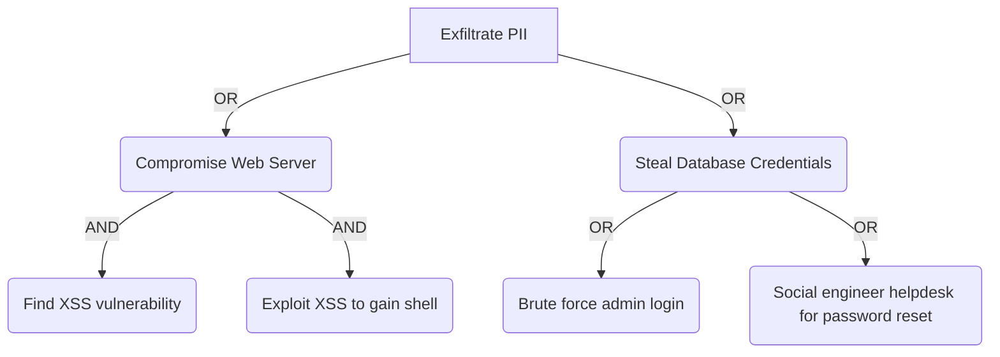

# Attack Tree Construction

Systematically model adversary objectives into structured attack trees to visualize and prioritize security defenses.

## When to Use This Skill

- Mapping complex attack paths against a system
- Identifying the most cost-effective defense points
- Communicating security risks to non-technical stakeholders
- Supplementing threat modeling reports
- Determining the "blast radius" of a potential compromise

## Core Concepts: Tree Structure

Attack trees model the attacker's goal (the root node) as a combination of sub-goals (children).

-   **Root Node (Goal):** The high-level objective (e.g., "Gain Administrator Access").
-   **AND Node:** All child sub-goals must be achieved for the parent goal to be met.
-   **OR Node:** Achieving *any* single child sub-goal satisfies the parent goal.

## Key Patterns

### Pattern 1: Visualizing a Simple Attack (Cluster: Security)

Goal: Exfiltrate PII from the database.

-   If the attacker compromises the web server (path A $\rightarrow$ B), they can exfiltrate.
-   If they steal credentials (path A $\rightarrow$ C), they can also exfiltrate.
-   The path $\text{A} \rightarrow \text{B} \rightarrow \text{B1} \rightarrow \text{B2}$ is an AND chain, making it a complex path.

### Pattern 2: Attack Tree Calculation (Cost Estimation)
Assigning a cost (time, skill, resources) to each node allows you to calculate the minimum cost for the attacker to achieve the goal.

$$\text{Cost}(\text{Goal}) = \sum \text{Cost}(\text{AND Children}) \quad \text{or} \quad \min(\text{Cost}(\text{OR Children}))$$

## Best Practices

-   **Start High:** Always define the attacker's ultimate goal first.
-   **Use Standard Notation:** Clearly label AND/OR nodes.
-   **Tie to Controls:** Map successful leaf nodes (unmitigated steps) directly to security controls.
-   **Keep It Abstract:** Avoid tool-specific attack details unless necessary for communicating a specific defense.

## References

-   [Schneier on Attack Trees](references/schneier-attack-trees.html)
-   [OWASP Threat Modeling Guide](references/owasp-threat-modeling.html)

---

**Remember:** Attack trees are a tool for risk communication, showing *how* an attacker could win. (Cluster: Security)
