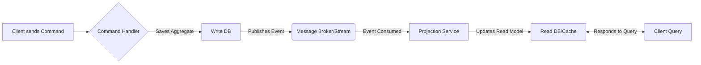

# Command Query Responsibility Segregation (CQRS)

Implement CQRS by separating the models and interfaces used for updating data (Commands) from those used for reading data (Queries).

## When to Use This Skill

- When read and write loads are significantly different (high read volume).
- When performance optimization for reads requires a different data store (e.g., denormalized view).
- Building systems that benefit from event sourcing or eventual consistency.
- When business complexity requires distinct aggregate models for updates and reads.

## Core Components

### 1. Commands (Write Side)
-   **Purpose:** Handle state changes (Create, Update, Delete).
-   **Model:** Optimized for business logic, transactions, and consistency. Often maps directly to a Domain Model/Aggregate Root.
-   **Output:** Commands usually result in an Event or a success/failure response.

### 2. Queries (Read Side)
-   **Purpose:** Retrieve data (Read operations).
-   **Model:** Optimized for fast retrieval (denormalized, materialized views, simple projections).
-   **Decoupled:** Queries should not know about command logic or transactional boundaries.

### 3. Event/Projection Layer (Optional but common)
-   Commands result in Events.
-   Events are consumed by **Projections** which update the Read Model.

## Key Patterns

### Pattern 1: Separate Models (Cluster: Architecture)
Each microservice must manage its own private database schema. Other services access the data only through that service's API or published events.

### Pattern 2: Asynchronous Projection Update (Cluster: Architecture)
Use an event stream to update the read model asynchronously.

### Pattern 3: Query Handlers
Queries are simple functions that bypass the write stack entirely.

## Best Practices

-   **Query Optimization:** Read models can be highly specialized (e.g., Elasticsearch for search).
-   **Command Simplicity:** Write handlers should be thin wrappers around domain logic.
-   **Data Synchronization:** Embrace eventual consistency; notify clients when data might be stale.

## References

-   [CQRS Official Site](references/cqrs-official.html)
-   [Event Sourcing Patterns](references/event-sourcing.md)
-   [Data Projection Strategies](references/data-projection.md)

---

**Remember:** CQRS is a pattern for managing complexity where reads and writes have different performance/consistency requirements. (Cluster: Architecture)
